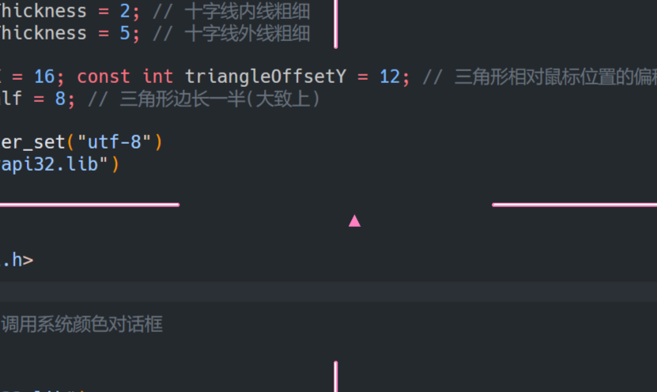
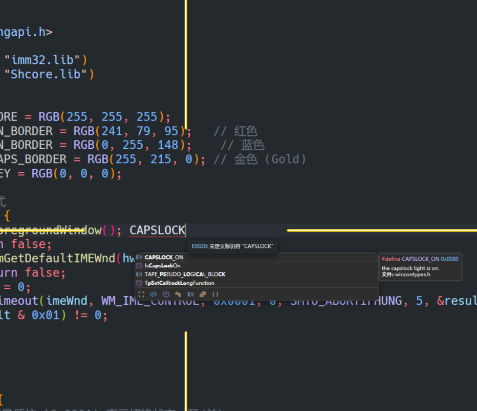

# 输入法抬头提示器 ~ 随输入法改变颜色 ~ 自定义样式

这是一个输入法状态的提示器。在不同的输入法下，它会用不同的颜色在鼠标附近显示一个非常醒目的标志。

# 默认条件下:

* **大写锁定模式** -> 绿色
* **英文输入模式** -> 蓝色
* **中文输入模式** -> 红色

# 样式:

目前版本支持两种样式自由搭配：以鼠标为中心放射的十字线，或是鼠标右下的一个小三角形。

* **十字线模式**：本项目是模仿微软 **PowerToys** 中的应用“鼠标十字线”设计的。
* **颜色自定义**：所有颜色都支持自定义，点开任务栏托盘右键可以调出色盘选择你想要的颜色。
* **自动保存**：所有配置都会自动保存。
* **开机自启**：可以选择开机自启。

# 开发说明:

* **环境**：程序由 C++ 编写，下载源码后请用 **Visual Studio 2022** 打开。
* **自定义参数**：我把每个模式下的图像参数放在了 `main.cpp` 文件头，方便用户自行修改自定义。
