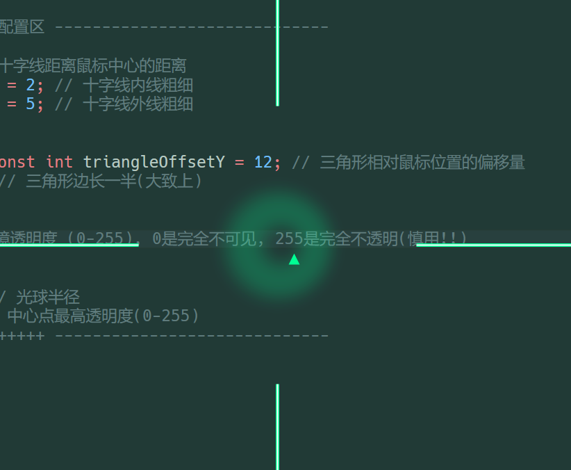

# 输入法抬头提示器 ~ 随输入法改变颜色 ~ 自定义样式
* 这是一个基于 C++ Win32 和 GDI+ 的输入法状态抬头提示器，支持多屏，支持透明层穿透. 
* 在不同的输入法下，它会用不同的颜色在鼠标附近显示一个非常醒目的标志

# 提供四种标识样式:

* **1. 鼠标指针为中心的十字线**
* **2. 鼠标指针右下角的三角形**
* **3. 全屏染色滤镜**
* **4. 鼠标指针周围的透明光球**

 以上, 支持这些模式的任意组合 (但滤镜模式下不建议开启其他模式, 会掉帧)

# 默认条件下:

* **大写锁定模式** -> 绿色
* **英文输入模式** -> 蓝色
* **中文输入模式** -> 红色

所有颜色均支持自定义

(十字线模式是模仿微软 **PowerToys** 中的“鼠标指针十字线”功能设计的)

* 系统托盘里右键图标可以进行设置

* **颜色自定义**: 可以调出色盘来选择颜色
* **自动保存**: 你勾选的配置都会自动保存
* **开机自启**：可以选择开机自启

# 开发说明:

* **环境**：程序由 C++ 编写，下载源码后请用 **Visual Studio 2022** 打开
* **自定义参数**：每个模式下的图像参数放在 `main.cpp` 文件头，方便用户自行修改自定义
